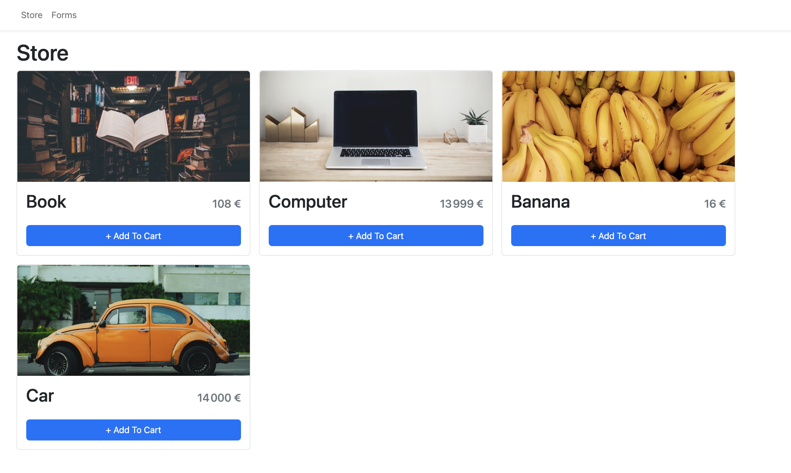
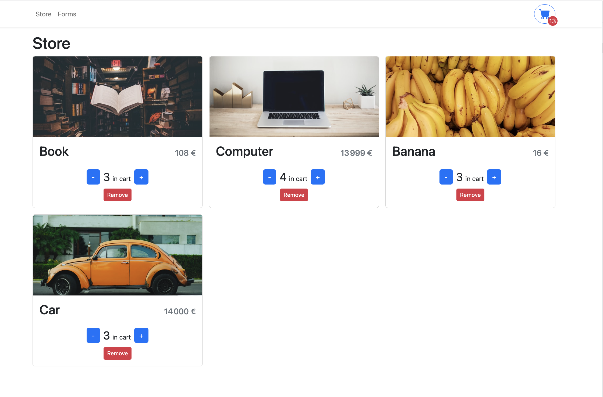
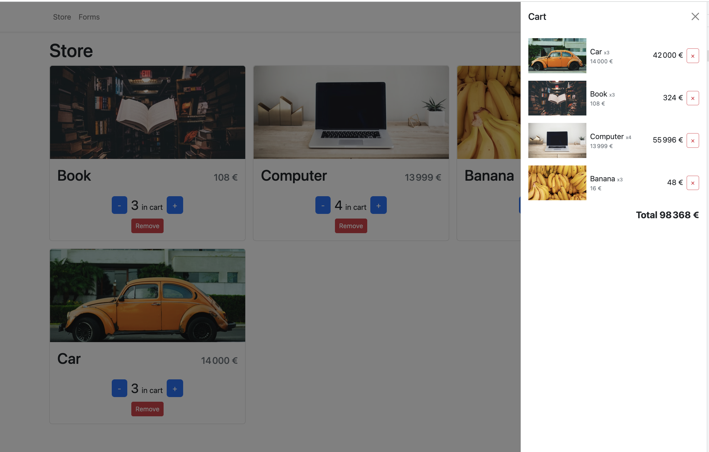
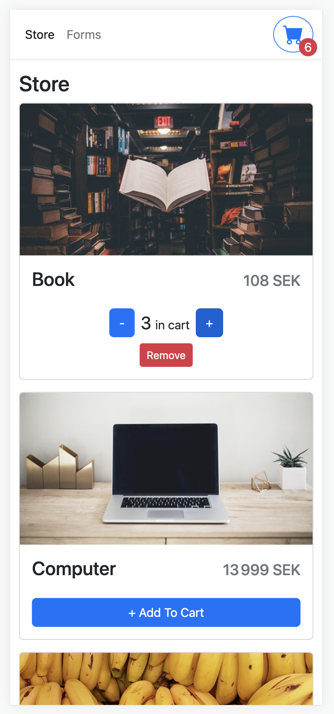
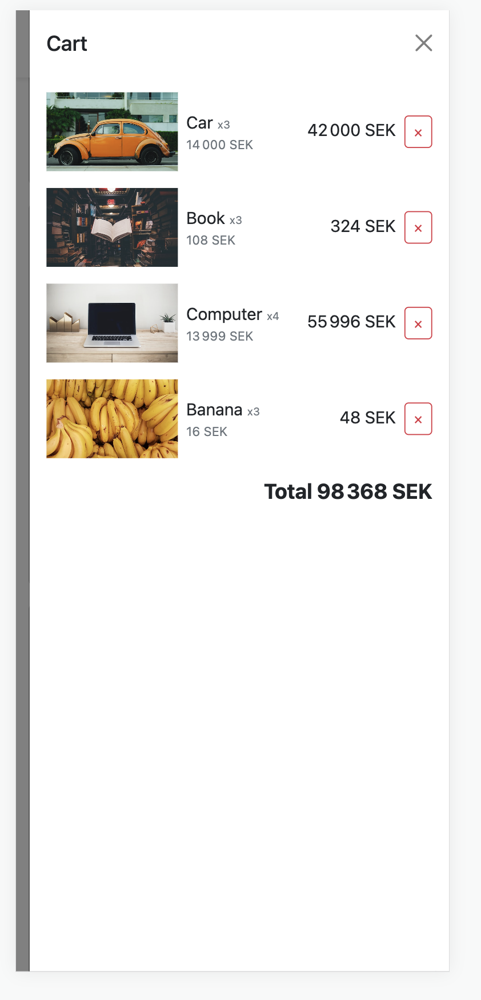
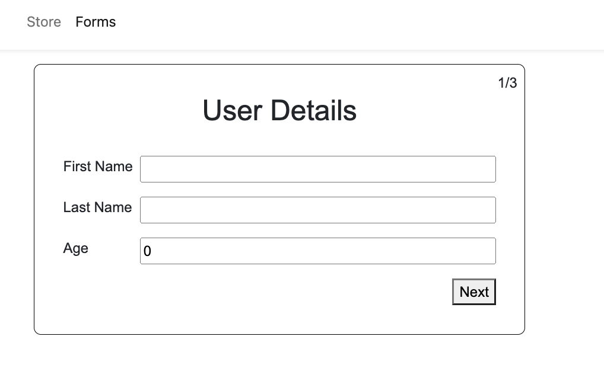
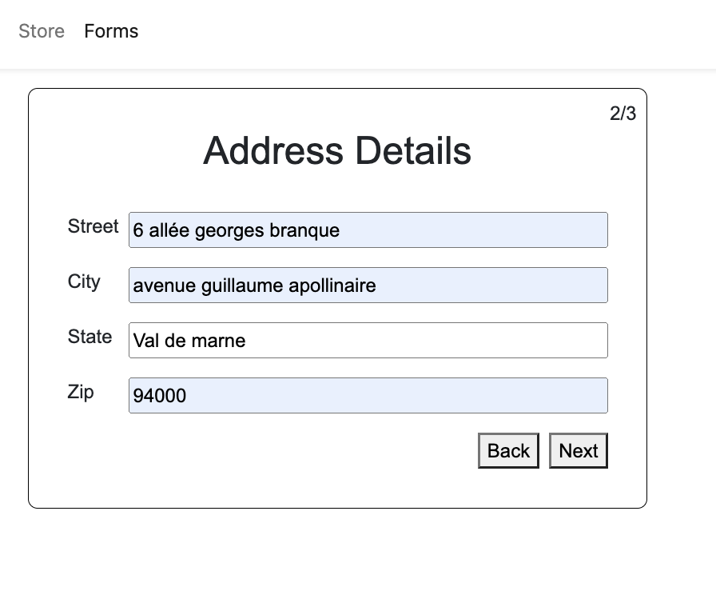
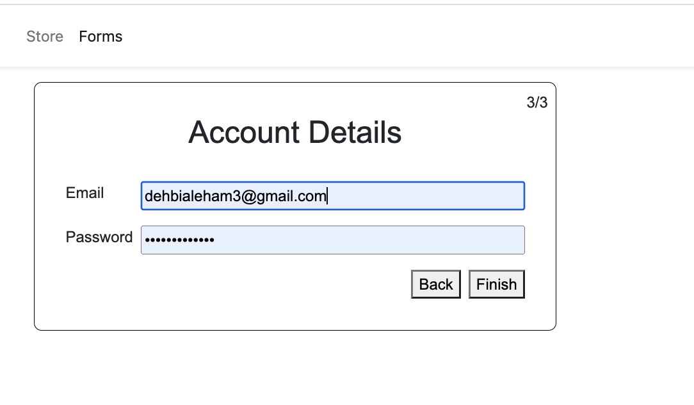
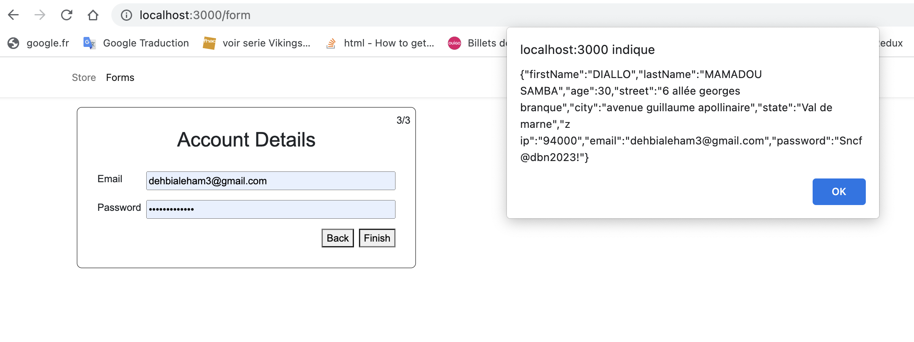

# Shopping-Cart-App and Multi-Forms in Type Script

Start application by typing in the terminal ” npm start  “ after interling dependencies
# About Shoping Cart

Shopping cart with React and Typescript. Add products to you shopping cart in the store page.
You can add multiply product and se the total cost. You can also delete products and the application will count how much your shopping cart cost.

# Simple MultiStep Form in React and TypeScript

# Technologies

    1. React
    2. TypeScript
